# TeraTerm

## インストールの手順

### ダウンロード

下記サイトからTeraTermをダウンロードする  
https://forest.watch.impress.co.jp/library/software/utf8teraterm/

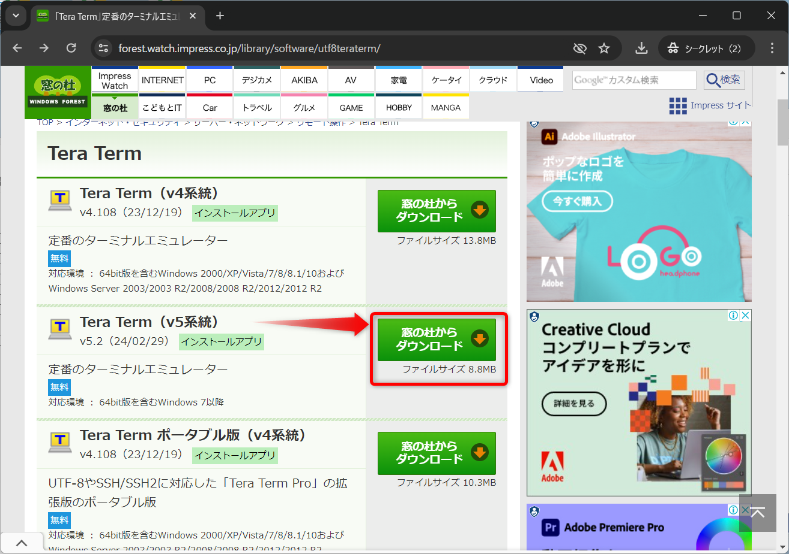

`ダウンロード`フォルダに保存する  
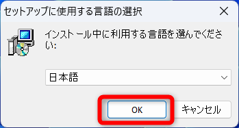

### インストール

ダウンロードしたファイルを実行  
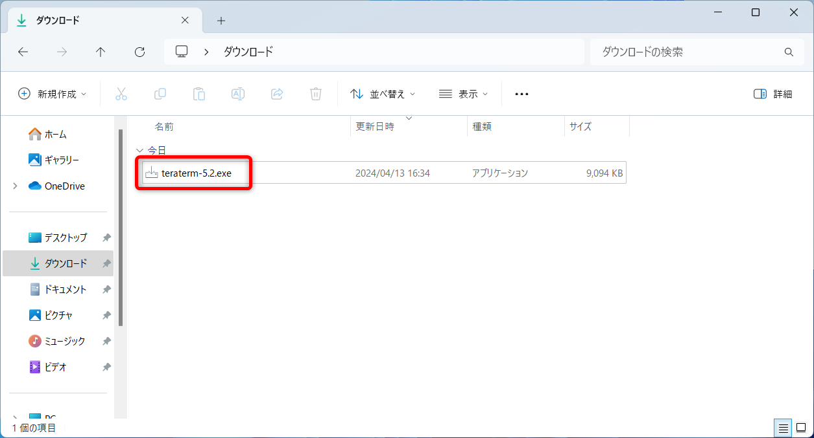

`日本語`のまま`OK`をクリック  
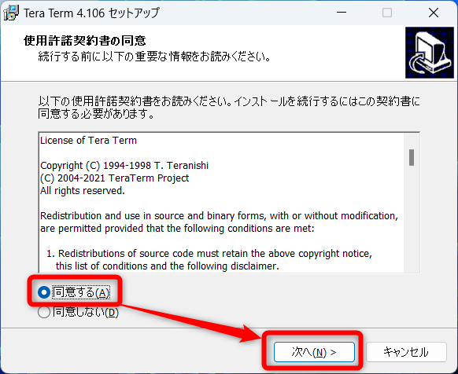

`同意する`にチェックを入れて、`次へ`をクリック  
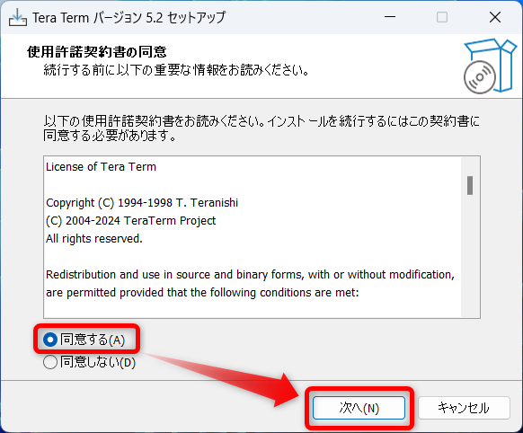

`次へ`をクリック    
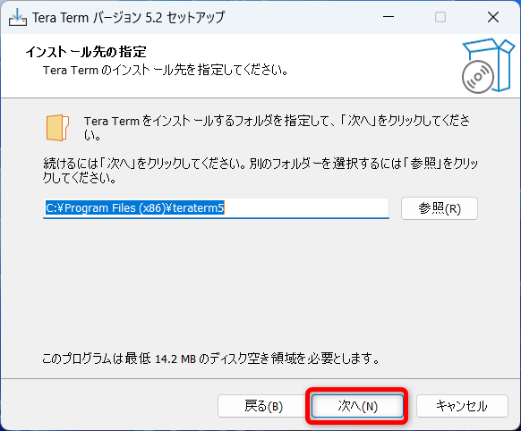

`次へ`をクリック    
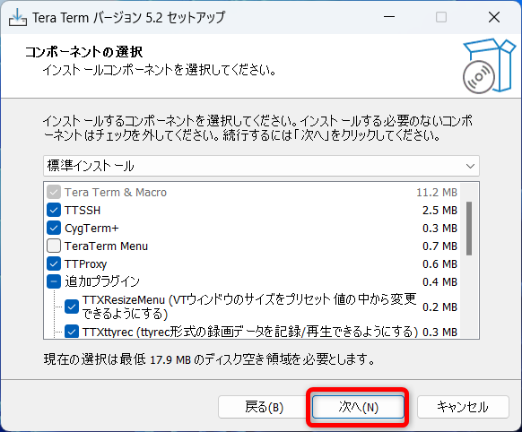

`日本語`であることを確認して`次へ`をクリック  
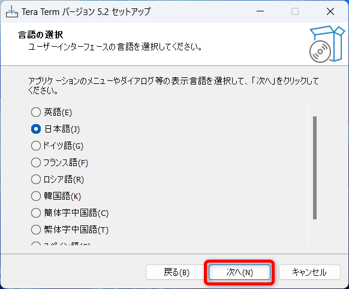

`次へ`をクリック    
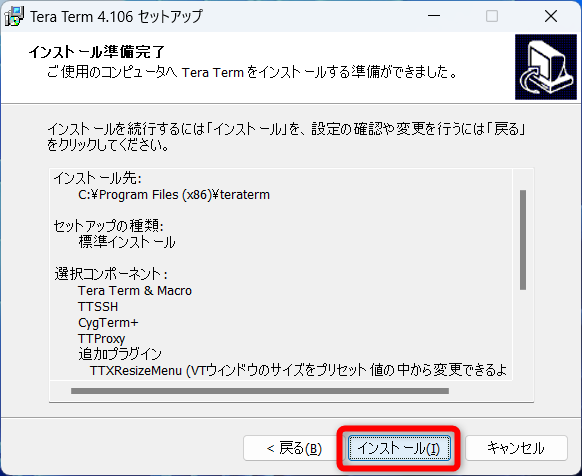

`次へ`をクリック    
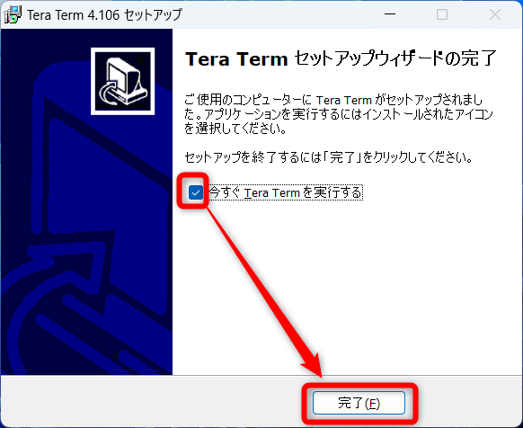

`インストール`をクリック  
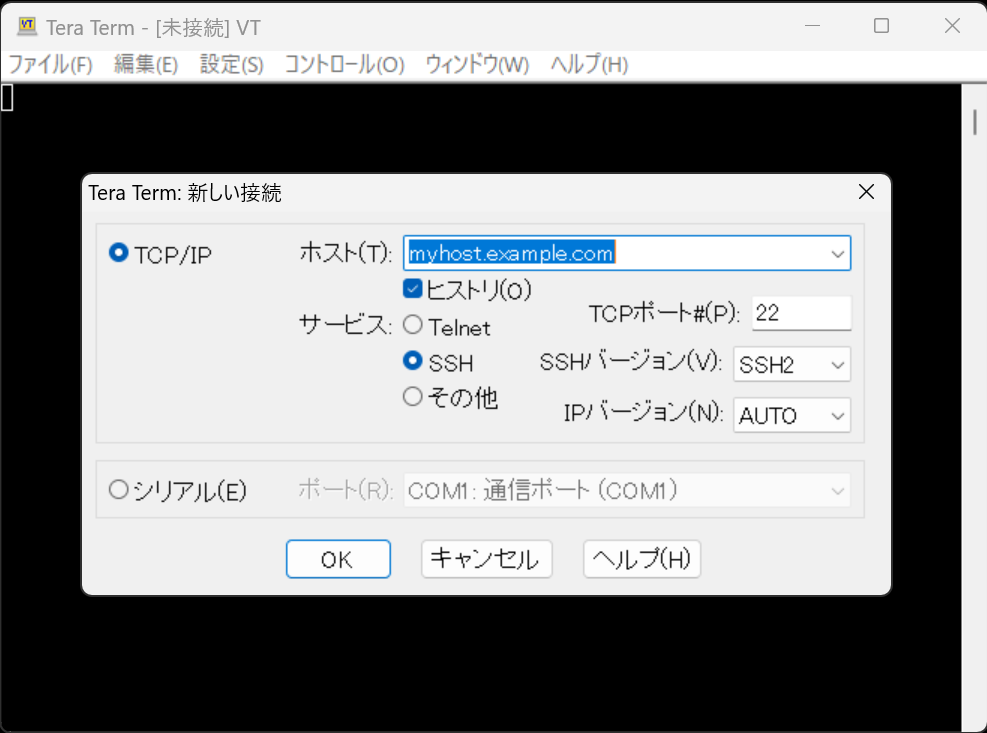

`今すぐ Tera Term を実行する`にチェックを入れて、`完了`をクリック  
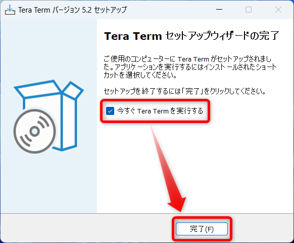

Tera Termが起動すればインストール完了  
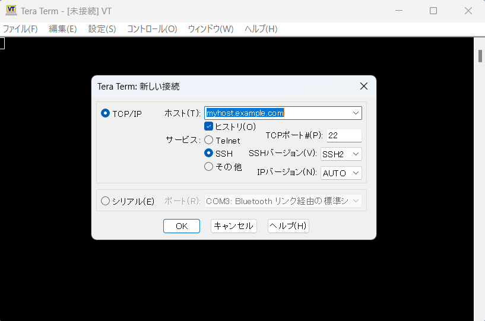

## Deleteキーの設定変更

`設定`→`キーボード`  
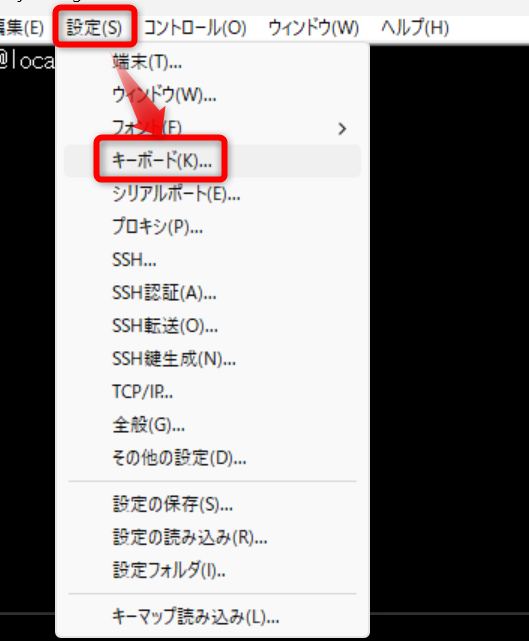

`Deleteキー`のチェックを外す  
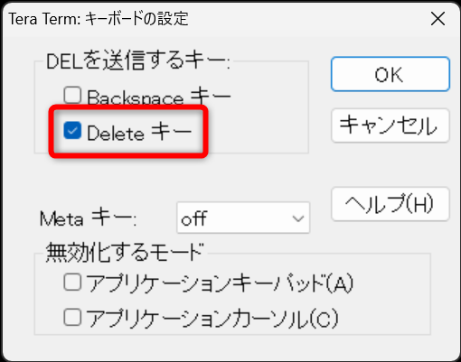

`OK`をクリック  
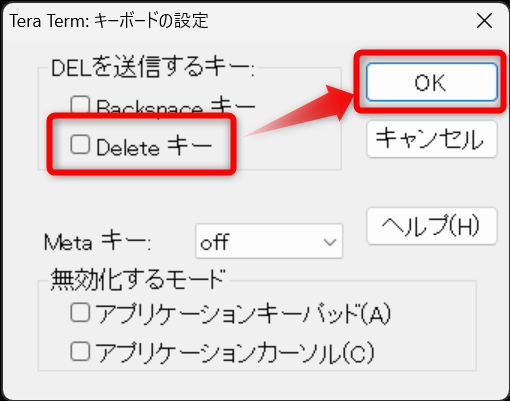

`設定`→`設定の保存`で設定を保存  
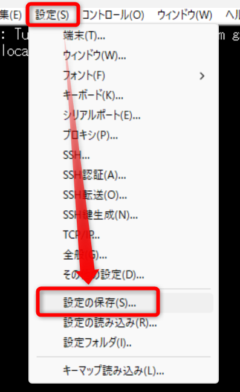

