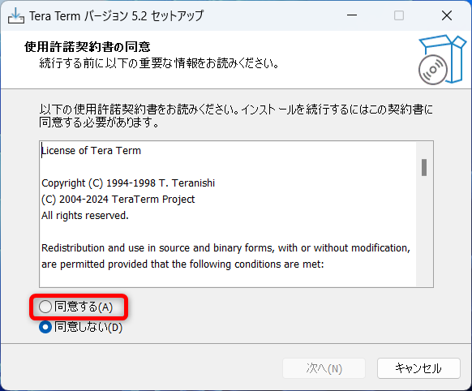

# TeraTerm

## インストールの手順

### ダウンロード

下記サイトからTeraTermをダウンロードする  
https://forest.watch.impress.co.jp/library/software/utf8teraterm/

### インストール

ダウンロードしたファイルを実行

`日本語`のまま`OK`をクリック  

`同意する`にチェックを入れて、`次へ`をクリック  

`次へ`をクリック  

`次へ`をクリック    

`日本語`であることを確認して`次へ`をクリック  

`次へ`をクリック    

`次へ`をクリック    

`インストール`をクリック  

`今すぐ Tera Term を実行する`にチェックを入れて、`完了`をクリック  

Tera Termが起動すればインストール完了  

