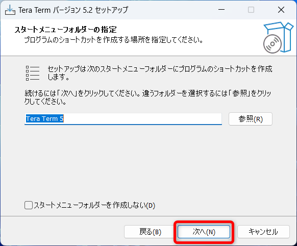
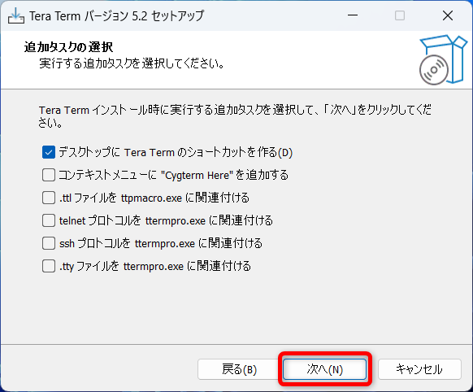
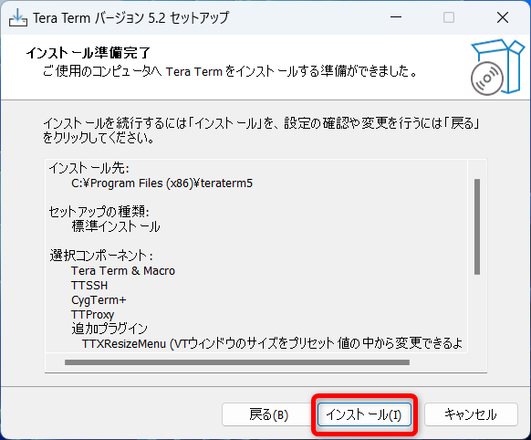

# TeraTerm

## インストールの手順

### ダウンロード

下記サイトからTeraTermをダウンロードする  
https://forest.watch.impress.co.jp/library/software/utf8teraterm/

`ダウンロード`フォルダに保存する  

### インストール

ダウンロードしたファイルを実行  

`日本語`のまま`OK`をクリック  

`同意する`にチェックを入れて、`次へ`をクリック  

`次へ`をクリック    

`次へ`をクリック    

`日本語`であることを確認して`次へ`をクリック  

`次へ`をクリック    

`次へ`をクリック    

`インストール`をクリック  

`今すぐ Tera Term を実行する`にチェックを入れて、`完了`をクリック  

Tera Termが起動すればインストール完了  

## Deleteキーの設定変更

`設定`→`キーボード`  

`Deleteキー`のチェックを外す  

`OK`をクリック  

`設定`→`設定の保存`で設定を保存  

