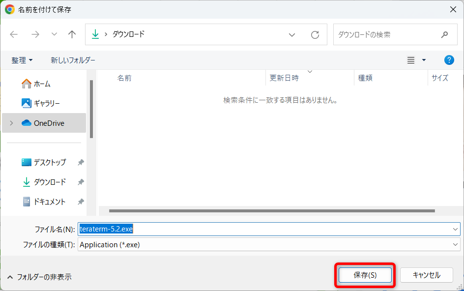

# TeraTerm

## インストールの手順

### ダウンロード

下記サイトからTeraTermをダウンロードする  
https://forest.watch.impress.co.jp/library/software/utf8teraterm/

### インストール

ダウンロードしたファイルを実行してください。

「日本語」のまま「OK」をクリックしてください。  

「同意する」にチェックを入れて、「次へ」をクリックしてください。  

「次へ」をクリックしてください。  

「次へ」をクリックしてください。  

「日本語」であることを確認して「次へ」をクリックしてください。  

「次へ」をクリックしてください。  

「次へ」をクリックしてください。  

「インストール」をクリックしてください。  

「今すぐ Tera Term を実行する」にチェックを入れて、「完了」をクリックしてください。  

Tera Termが起動します。  

